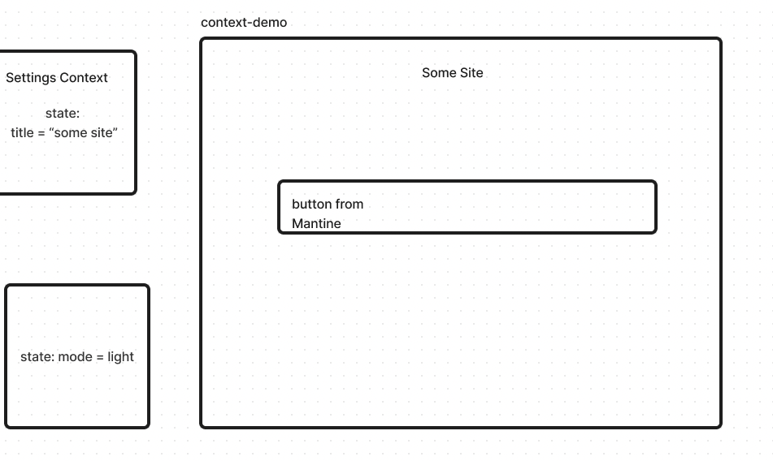

# LAB - Class 26

## Project: Component Based UI

### Author: Malik Sadiki-Torres

### Problem Domain

Restful API testing application

### Links and Resources

[Will be added]()

### Collaborators
I referenced Ryan Gallaways demo and AI for testing

### Setup

run npx create-react-app

#### `.env` requirements (where applicable)

#### How to initialize/run your application (where applicable)

clone repo, `npm i`, then run `nodemon` in the terminal. Then set up your postgres database

#### Routes

#### Tests

to run tests, after running `npm i`, run the command `npm test`

#### UML

